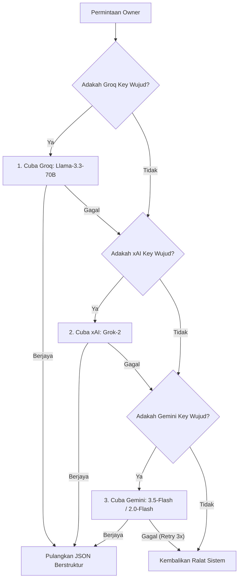

# Dokumentasi Seni Bina & Ejen AI Dinspire (Blueprint Kejuruteraan Terperinci)

Dokumentasi ini adalah spesifikasi kejuruteraan sistem (*Engineering Blueprint*) berketepatan tinggi yang menerangkan reka bentuk keseluruhan (seni bina), pelaksanaan, aliran data, ciri-ciri keselamatan, sistem pengurusan kewangan, dan modul Ejen AI yang menjana sistem **Dinspire**. 

Ianya direka khusus supaya Jurutera Perisian atau Ejen AI dapat memahami setiap logik teras tanpa perlu menyelongkar beribu baris kod.

---

## 1. Seni Bina Sistem (System Architecture)

Sistem Dinspire dibangunkan berasaskan **Node.js (Express)** untuk pelayan belakang (*backend*) dan antaramuka HTML/CSS/JS (Vanilla) untuk bahagian hadapan (*frontend*). Ia beroperasi pada pangkalan data awan **Supabase (PostgreSQL)** menggunakan seni bina *RESTful API* sepenuhnya.

Sistem ini mempunyai empat (4) titik akses utama:
1. **Portal Pelanggan (App):** Pusat operasi awam untuk carian servis, produk, troli, dan sejarah tempahan.
2. **Papan Pemuka Pemilik (Owner):** Mengandungi analitik penuh, Ejen AI Dinspire, paparan komisen, dan pemantauan jumlah yuran yang dikutip (Service Fee & Shipping Fee).
3. **Papan Pemuka Staf (Staff):** Memudahkan pekerja menguruskan tempahan aktif, menukar status tempahan ke "Selesai", merekod pelanggan *Walk-In*, dan mendaftar kedatangan (Punch In/Out) dengan pengesanan GPS (*Geofencing*).
4. **Papan Pemuka Pentadbir (Admin):** Modul Master Data (Senarai Servis, Produk, Cawangan, Pengurusan Jadual, dan Data Staf) yang berbentuk hamparan jadual (Grid).

---

## 2. Pengurusan Yuran & Integriti Harga (Financial Segregation)

Bagi menjamin ketelusan komisen pekerja dan mengelakkan manipulasi harga oleh penggodam, sistem Dinspire mempunyai mekanisme kewangan yang sangat ketat di dalam `routes/bookings.js`:

- **Anti-Manipulasi Harga (Anti-Tampering):** Nilai `total_price` yang dihantar dari *Frontend* (UI pelanggan) akan **diabaikan secara mutlak**. *Backend* Node.js akan mengkuiri (*query*) jadual Supabase (`haircuts`, `treatments`, `products`) berdasarkan ID yang dihantar untuk mendapatkan nilai `harga_rm` sebenar. Ini menjadikan sebarang cubaan menggodam harga (F12/Inspect Element) menjadi sia-sia.
- **`harga_rm` (Harga Asas):** Merupakan harga tulen perkhidmatan. Staf dibayar komisen berdasarkan harga ini sahaja.
- **`service_fee` (Yuran Servis):** Yuran tempahan yang dikenakan khas untuk *Haircuts*, *Treatments*, dan *On-Call*. Untuk pelanggan *Walk-in*, nilainya secara automatik dipintas dan ditetapkan kepada `0`.
- **`shipping_fee` (Yuran Penghantaran):** Yuran tetap (`setting_value`) yang hanya dicampur ke atas pembelian barangan (E-Commerce) yang menggunakan kaedah *Delivery*.
- **Pembentangan Analitik:** Pada *Owner Dashboard*, *Total Revenue* (hasil asas) dan *Collected Fees* (yuran sistem/caj tambahan) dipaparkan dan dikira secara berasingan untuk tujuan perakaunan syarikat yang 100% tepat.

---

## 3. Keselamatan Bertaraf 'Enterprise' (Security Measures)

Sistem Dinspire telah dilengkapi dengan pelbagai lapisan sekuriti pelayan:

1. **Perisai Saiz Muatan (Payload Limits):** Melindungi sistem dari serangan *Denial of Service (DoS)*.
   - Had **10MB** diizinkan khusus untuk laluan muat naik gambar (`/api/bookings`, `/api/admin`).
   - Had **100KB** dipaksa ke atas kesemua laluan lain (khasnya `/api/auth`) bagi menangkis lambakan teks besar.
2. **Penapisan Malware Muat Naik (Magic Number Validation):** Fungsi `uploadReceiptToStorage` tidak mempercayai format fail `.jpg/.png` dari *client*. Ia sebaliknya mencerakin *Buffer* fail untuk membaca *4 byte* pertama (Tandatangan Hex / *Magic Number* seperti `FFD8FF`) bagi membuktikan ia adalah imej tulen sebelum dihantar ke *Supabase Storage*.
3. **Penyulitan Kata Laluan (Bcrypt Hashing):** Semua kata laluan disulitkan di pangkalan data menggunakan `bcrypt` dengan *salt rounds* tahap 10, mengelakkan krisis kebocoran data (*Data Breach*).
4. **Dwi-Pengesahan Token (Dual JWT Auth):**
   - **`din_token_client`**: Ditandatangani menggunakan `JWT_SECRET_CLIENT`, terhad untuk portal pelanggan.
   - **`din_token_sys`**: Ditandatangani menggunakan `JWT_SECRET_SYS`, dikhaskan untuk Owner, Admin, dan Staf. Pelanggan mustahil memalsukan token untuk masuk ke laluan sistem.
5. **Global Rate Limiting:** Menyekat alamat IP yang melakukan lebih daripada 500 *request* dalam masa 15 minit untuk API am, dan had ketat 5 percubaan untuk laluan *Login* & *OTP*.
6. **Polisi Pangkalan Data (RLS):** *Row Level Security* (RLS) di pihak Supabase dikonfigurasi untuk menahan serangan luar, manakala *Backend* beroperasi secara autonomi menggunakan *Service Role Key* rahsia yang memintas RLS dengan selamat.
7. **Sistem Perangkap Ralat (Global Try-Catch):** Setiap API dilengkapi *Error Handler* global. Kegagalan fungsi/ketiadaan sambungan tidak akan mematikan pelayan (*crash*), sebaliknya ditukar menjadi maklum balas JSON 500 yang selamat tanpa mendedahkan struktur logikal dalaman.

---

## 4. Sistem Log Masuk & Notifikasi Automatik (Auth & SMS Simulation)

Sistem ini mempunyai aliran log masuk terbahagi:
1. **Pengesahan Berperingkat (Pendaftaran & Lupa Kata Laluan):** Menggunakan OTP (One-Time Password) melalui nombor telefon bagi menentusahkan wujudnya pengguna tersebut sebelum membenarkan kemasukan rekod. 
2. **Log Masuk Kata Laluan Segera:** Untuk kelajuan, pengguna berdaftar hanya perlu memasukkan nombor telefon dan kata laluan. *Backend* akan melakukan `bcrypt.compare` dengan segera tanpa perlunya fungsi OTP membebankan pengguna harian.
3. **Log Masuk Sistem Berhierarki (Role-Spoofing Prevention):** Kod `/system-login` mengabaikan parameter `role` yang dihantar oleh klien. Pelayan akan mencari sendiri wujud atau tidak pengguna tersebut di dalam jadual `owners`, kemudian turun ke `admins`, dan akhir sekali `staff`.
4. **Penjadualan SMS Automatik (`node-schedule`):**
   - **Tempahan Servis:** Simulasi SMS dipancarkan semasa pelanggan selesai menempah. Serentak dengan itu, skrip *Node Schedule* diaktifkan di latar belakang yang akan menembak "SMS Peringatan" tepat **2 jam** sebelum masa tempahan pelanggan bermula.
   - **Pembelian Produk:** Simulasi SMS "Penghantaran" tercetus automatik apabila pemilik mengemaskini *Tracking Number* pesanan di ruangan *Owner Dashboard*.

---

## 5. Ejen AI Pintar (Dinspire AI Agent)

Papan Pemuka Pemilik (`/ai-insights`) dilengkapi otak Analitik AI yang disuap data syarikat (*Business Intelligence*).

### A. Peranan Ejen AI
1. **Konsultan Perniagaan Eksekutif:** Memproses Jualan Bersih (*Net Revenue*), Prestasi Staf harian, analisis sentimen dari ulasan pelanggan, dan menyusunnya kepada laporan rasmi.
2. **Pengawal Antaramuka (UI Controller):** Ejen tidak sekadar berbual, ia berkeupayaan menukar halaman (Switch Tab) dan melukis carta statistik (Show Chart) atas arahan UI pengguna secara magis melalui bacaan JSON.

### B. Seni Bina Multi-Model (Fallback & Load Balancing)
Bagi mengelakkan sistem lumpuh sekiranya API luaran tergendala (Down), Ejen Dinspire direka bentuk secara *Resilient* dengan hierarki panggilan:



### C. Aliran Data Konteks AI (Data Context)
Semasa setiap sesi berbual, *Backend* akan membekalkan bingkisan data (*payload*) berstruktur kepada AI untuk dinilai:
- **`RingkasanTempahanTerkini`:** Metadata pelanggan dan rekod bil (sudah ditolak yuran servis/komisen).
- **`RingkasanJualanProduk`:** Aliran pembelian E-Commerce.
- **`RekodKehadiranStaf`:** Perbandingan waktu *Punch-In* pekerja beserta ketepatan (*GPS Geofencing*).
- **`MaklumBalasPelanggan`:** Sentimen harian dari bintang 1 ke 5 untuk pemantauan kualiti operasi.

### D. Skema Output (JSON)
AI dikunci tegar (Hard-Coded) untuk sentiasa membalas menggunakan struktur format JSON berikut supaya *Frontend* dapat menterjemahkannya kepada tindakan Antaramuka (UI):
```json
{
  "text": "Teks Jawapan AI berformat Markdown.",
  "action": "SWITCH_TAB" | "SHOW_CHART" | null,
  "target": "dashboard" | "transactions" | "reviews" | "sales" | "staff" | null
}
```

---

*Dokumentasi kejuruteraan ini merangkumi keseluruhan logik dan anatomi belakang tabir (*under-the-hood*) Sistem Dinspire untuk rujukan penyelenggaraan tahap Enterprise.*
