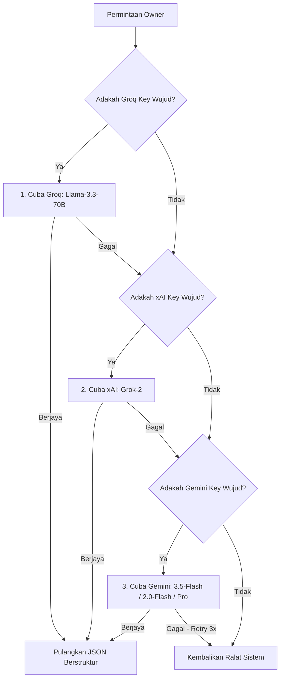

# Dokumentasi Seni Bina & Ejen AI Dinspire (Blueprint Kejuruteraan Terperinci)

Dokumentasi ini adalah spesifikasi kejuruteraan sistem (*Engineering Blueprint*) berketepatan tinggi yang menerangkan reka bentuk keseluruhan (seni bina), pelaksanaan, aliran data, ciri-ciri keselamatan, sistem pengurusan kewangan, dan modul Ejen AI yang menjana sistem **Dinspire**.

Ianya direka khusus supaya Jurutera Perisian atau Ejen AI dapat memahami setiap logik teras tanpa perlu menyelongkar beribu baris kod.

---

## 1. Seni Bina Sistem (System Architecture)

Sistem Dinspire dibangunkan berasaskan **Node.js (Express v5)** untuk pelayan belakang (*backend*) dan antaramuka HTML/CSS/JS (Vanilla) untuk bahagian hadapan (*frontend*). Ia beroperasi pada pangkalan data awan **Supabase (PostgreSQL v17)** menggunakan seni bina *RESTful API* sepenuhnya.

### 1.1 Titik Akses Utama

Sistem ini mempunyai lima (5) titik akses:

1. **Portal Pelanggan (`public/customer/index.html`):** Aplikasi web mudah alih (*Mobile-First PWA*) untuk pendaftaran akaun, tempahan servis (Gunting, Rawatan, On-Call), pembelian produk E-Commerce, pembayaran QR/FPX, penjejakan pesanan, dan penghantaran ulasan.
2. **Papan Pemuka Pemilik (`public/owner/index.html`):** Suite analitik eksekutif mengandungi penapisan jualan harian/mingguan/bulanan/tahunan, carta Chart.js, Ejen AI Dinspire, pengurusan pesanan, kelulusan cuti, kehadiran GPS, dan laporan kewangan.
3. **Papan Pemuka Staf (`public/staff/index.html`):** Portal mudah alih untuk pekerja merekod pelanggan Walk-In, menyelesaikan tempahan aktif, mendaftar kedatangan (Punch In/Out) dengan GPS *Geofencing*, dan pengurusan cuti bulanan/kecemasan.
4. **Papan Pemuka Pentadbir (`public/admin.html`):** Panel CMS Master Data berbentuk hamparan jadual untuk menguruskan 13 modul data (Senarai Servis, Produk, Cawangan, Staf, Tetapan Sistem, dan lain-lain).
5. **Pemuat Turun Arkib (`public/owner/archive-download.html`):** Halaman pembantu yang menjana laporan Excel (`.xlsx`) dan memampatkan resit-resit ke dalam fail `.zip` untuk dimuat turun.

### 1.2 Pemasangan Laluan API (`server.js`)

Semua laluan dimount di bawah namespace `/api`:
- `app.use("/api/auth", require("./routes/auth"))` — Pengesahan & OTP
- `app.use("/api/shop-data", require("./routes/shop"))` — Data Kedai Awam
- `app.use("/api/admin", require("./routes/admin"))` — Panel CMS Admin
- `app.use("/api/owner", require("./routes/owner"))` — Analitik Pemilik
- `app.use("/api/staff", require("./routes/staff"))` — Operasi Staf
- `app.use("/api/bookings", require("./routes/bookings"))` — Tempahan & E-Commerce

### 1.3 Tugas Latar Belakang Automatik (`node-schedule`)

Pelayan menjalankan beberapa tugas berjadual secara automatik:
- **Pembersihan Slot FPX Pending (`*/5 * * * *`):** Setiap 5 minit, hapuskan tempahan yang belum dibayar (`FPX_PENDING:*` lebih 15 minit) untuk mengelakkan penimbunan slot.
- **Pembersihan Cuti Lepas (`0 0 1 * *`):** Setiap 1hb bulan pada tengah malam, buang rekod cuti yang sudah tamat tempoh.
- **Pembersihan Harian (`0 3 * * *`):** Setiap pukul 3:00 pagi.
- **Pemotongan Data Tahunan (`0 0 1 2 *`):** Setiap 1hb Februari pada tengah malam melalui `pruneYearlyData()`.
- **Pemulihan SMS Automatik:** Semasa pelayan dimulakan, `recoverSMSReminders()` menjadualkan semula peringatan SMS 2 jam sebelum tempahan aktif.

---

## 2. Pengurusan Yuran & Integriti Harga (Financial Segregation)

Bagi menjamin ketelusan komisen pekerja dan mengelakkan manipulasi harga oleh penggodam, sistem Dinspire mempunyai mekanisme kewangan yang sangat ketat di dalam `routes/bookings.js`:

- **Anti-Manipulasi Harga (Anti-Tampering):** Nilai `total_price` yang dihantar dari *Frontend* (UI pelanggan) akan **diabaikan secara mutlak**. *Backend* Node.js akan mengkuiri (*query*) jadual Supabase (`haircuts`, `treatments`, `products`) berdasarkan ID yang dihantar untuk mendapatkan nilai `harga_rm` sebenar. Ini menjadikan sebarang cubaan menggodam harga (F12/Inspect Element) menjadi sia-sia.
- **`harga_rm` (Harga Asas & Tempahan):** Bermula asalnya sebagai harga perkhidmatan sahaja, tetapi setelah staf menekan butang "Selesai", **yuran tempahan (`service_fee`) akan dicampurkan secara automatik ke dalam `harga_rm`** atas permintaan pemilik. Ini bermaksud staf akan turut menerima komisen daripada yuran tempahan pelanggan (Booking Fee) kerana komisen dikira berdasarkan nilai `harga_rm` yang telah disatukan ini.
- **`service_fee` (Yuran Servis):** Yuran tempahan asal. Ia tetap direkodkan berasingan pada permulaan tempahan, namun akan digabungkan ke dalam `harga_rm` pada penghujung servis.
- **`shipping_fee` (Yuran Penghantaran):** Yuran tetap (`setting_value`) yang hanya dicampur ke atas pembelian barangan (E-Commerce) yang menggunakan kaedah *Delivery*.
- **Pembentangan Analitik:** Pada *Owner Dashboard*, *Total Revenue* kini merangkumi kedua-dua harga perkhidmatan dan yuran tempahan disebabkan penggabungan di atas.

---

## 3. Keselamatan Bertaraf 'Enterprise' (Security Measures)

Sistem Dinspire telah dilengkapi dengan pelbagai lapisan sekuriti pelayan:

1. **Penyamaran Pelayan (Header Security):**
   - `app.disable("x-powered-by")` menyembunyikan tandatangan Express.
   - Integrasi `helmet()` untuk HTTP Security Headers.
   - Header Anti-Caching (`Cache-Control: no-store, no-cache, must-revalidate`) untuk respons API sensitif.

2. **Perisai Saiz Muatan (Payload Limits):** Melindungi sistem dari serangan *Denial of Service (DoS)*.
   - Had **10MB** diizinkan khusus untuk laluan muat naik gambar (`/api/bookings`, `/api/admin`).
   - Had **100KB** dipaksa ke atas kesemua laluan lain (khasnya `/api/auth`) bagi menangkis lambakan teks besar.

3. **Penapisan Malware Muat Naik (Magic Number Validation):** Fungsi `uploadReceiptToStorage` tidak mempercayai format fail `.jpg/.png` dari *client*. Ia sebaliknya mencerakin *Buffer* fail untuk membaca *4 byte* pertama (Tandatangan Hex / *Magic Number* seperti `FFD8FF` JPEG, `89504E47` PNG, `47494638` GIF, `52494646` WEBP) bagi membuktikan ia adalah imej tulen sebelum dihantar ke *Supabase Storage*. Had saiz fail: 5MB. Sanitasi laluan fail (*path traversal*).

4. **Penyulitan Kata Laluan (Bcrypt Hashing):** Semua kata laluan disulitkan di pangkalan data menggunakan `bcrypt` dengan *salt rounds* tahap 10, mengelakkan krisis kebocoran data (*Data Breach*).

5. **Dwi-Pengesahan Token (Dual JWT Auth):**
   - **`din_token_client`**: Ditandatangani menggunakan `JWT_SECRET_CLIENT`, terhad untuk portal pelanggan. Tempoh sah: 1 jam (atau 30 hari jika *Remember Me*).
   - **`din_token_sys`**: Ditandatangani menggunakan `JWT_SECRET_SYS`, dikhaskan untuk Owner, Admin, dan Staf. Tempoh sah: 12 jam (atau 30 hari). Pelanggan mustahil memalsukan token untuk masuk ke laluan sistem.
   - **Senarai Hitam JWT (*In-Memory Blacklist*):** Token yang telah *logout* disimpan dalam `global.jwtBlacklist` (Map). Kutipan sampah automatik setiap jam membuang token yang melebihi 24 jam.

6. **Perlindungan Concurrency (Mutex Locks):** Kunci *in-memory* (`bookingLocks`, `oncallLocks`, `punchLocks`, `reviewLocks`, `completionLocks`) mengelakkan keadaan *TOCTOU / Race Condition* bagi operasi kritikal.

7. **Pertahanan Serangan Timing (Timing Attack Protection):** Laluan `/login` melakukan `bcrypt.compare` palsu (*dummy*) walaupun pengguna tidak dijumpai, supaya masa respons sentiasa seragam dan penggodam tidak dapat meneka kewujudan akaun.

8. **Penguncian Akaun (Account Lockout):** Akaun pelanggan dikunci selepas 10 percubaan log masuk gagal.

9. **Global Rate Limiting:**
   - **API Am:** 500 *request* / 15 minit setiap IP.
   - **Login & OTP:** 5 percubaan / 1 minit setiap IP.
   - **Permintaan AI:** 5 *request* / 5 minit (mengelakkan pembakaran bil API AI).

10. **Kawalan CORS:** Senarai domain yang dibenarkan dikonfigurasikan melalui `ALLOWED_ORIGINS` dengan pengesahan dinamik untuk subdomain `.dinspirebarbershop.com` dan URL Vercel tertentu.

11. **Polisi Pangkalan Data (RLS):** *Row Level Security* (RLS) di pihak Supabase dikonfigurasi untuk menahan serangan luar, manakala *Backend* beroperasi secara autonomi menggunakan *Service Role Key* rahsia yang memintas RLS dengan selamat.

12. **Sistem Perangkap Ralat (Global Error Handling):** Setiap API dilengkapi *Error Handler* global. Kegagalan fungsi/ketiadaan sambungan tidak akan mematikan pelayan (*crash*), sebaliknya ditukar menjadi maklum balas JSON 500 yang selamat tanpa mendedahkan struktur logikal dalaman. Logger `Winston` merekod semua ralat dengan *stack trace*, IP, dan laluan.

13. **Pengawal Kegagalan Maut (Fail-Fast):** Pelayan menghentikan dirinya sendiri (`process.exit(1)`) serta-merta jika `SUPABASE_URL`, `SUPABASE_KEY`, `JWT_SECRET_CLIENT`, atau `JWT_SECRET_SYS` tidak dijumpai semasa permulaan.

---

## 4. Sistem Log Masuk & Notifikasi Automatik (Auth & SMS)

### 4.1 Aliran Pengesahan

1. **Pendaftaran Pelanggan (OTP):** Pelanggan mendaftar menggunakan nombor telefon. Kod OTP 6 digit dijanakan menggunakan `crypto` dan dihantar melalui SMS. OTP sah selama 5 minit. Percubaan salah melebihi 3 kali akan menghapuskan rekod OTP (*Brute-Force Protection*). Nama pelanggan melalui penapisan XSS (*HTML Tag Stripping*).

2. **Log Masuk Pelanggan:** Pengguna berdaftar memasukkan nombor telefon dan kata laluan. *Backend* melakukan `bcrypt.compare` dengan segera. Token `din_token_client` diterbitkan dan disimpan dalam *HttpOnly Cookie*.

3. **Lupa Kata Laluan:** Menggunakan aliran OTP yang sama. Setelah OTP disahkan, kata laluan baharu disulitkan dan dikemaskini.

4. **Log Masuk Sistem Berhierarki (Role-Spoofing Prevention):** Kod `/system-login` **mengabaikan** parameter `role` yang dihantar oleh klien. Pelayan mencari sendiri pengguna di dalam jadual `owners` → `admins` → `staff`. Sekiranya staf masih menggunakan kata laluan asal (`123123`) atau bendera `must_change_password=true`, sistem mengembalikan status `REQUIRE_PASSWORD_CHANGE` berserta token sementara (10 minit).

5. **Tukar Kata Laluan Staf:** Staf baharu **diwajibkan** menukar kata laluan lalai sebelum dapat mengakses papan pemuka.

6. **Permohonan Reset Kata Laluan Staf:** Staf boleh memohon reset. Admin melihat senarai permohonan di panel CMS dan meluluskannya (kata laluan direset ke `123123` secara automatik).

### 4.2 Penjadualan SMS Automatik (`node-schedule`)

- **Tempahan Servis:** SMS peringatan dijadualkan tepat **2 jam** sebelum masa tempahan pelanggan bermula. SMS ini dijadualkan semula secara automatik apabila pelayan dimulakan semula (*Auto-Recovery*).
- **Pembelian Produk:** SMS pemberitahuan penghantaran tercetus automatik apabila pemilik mengemaskini *Tracking Number* pesanan.

---

## 5. Ejen AI Pintar (Dinspire AI Agent)

Papan Pemuka Pemilik (Tab `Dinspire AI`) dilengkapi otak Analitik AI yang disuap data syarikat (*Business Intelligence*).

### A. Peranan Ejen AI
1. **Konsultan Perniagaan Eksekutif:** Memproses Jualan Bersih (*Net Revenue*), Prestasi Staf (jualan & bilangan pelanggan keseluruhan), analisis sentimen dari ulasan pelanggan, dan menyusunnya kepada laporan rasmi. Persona: Penasihat bertenaga yang mesra, memanggil pengguna "Tuan" / "Boss" dalam Bahasa Melayu.
2. **Pengawal Antaramuka (UI Controller):** Ejen tidak sekadar berbual, ia berkeupayaan menukar tab (*Switch Tab*), menukar penapis masa (*Change Filter*), dan melukis carta statistik (*Show Chart*) atas arahan pengguna secara dinamik melalui bacaan JSON.

### B. Seni Bina Multi-Model (Fallback & Load Balancing)
Bagi mengelakkan sistem lumpuh sekiranya API luaran tergendala (Down), Ejen Dinspire direka bentuk secara *Resilient* dengan hierarki panggilan:


```mermaid
graph TD
    A[Permintaan Owner] --> B{Adakah Groq Key Wujud?}
    B -- Ya --> C[1. Cuba Groq: Llama-3.3-70B]
    B -- Tidak --> D{Adakah xAI Key Wujud?}
    C -- Berjaya --> E[Pulangkan JSON Berstruktur]
    C -- Gagal --> D
    D -- Ya --> F[2. Cuba xAI: Grok-2]
    D -- Tidak --> G{Adakah Gemini Key Wujud?}
    F -- Berjaya --> E
    F -- Gagal --> G
    G -- Ya --> H[3. Cuba Gemini: 3.5-Flash / 2.0-Flash / Pro]
    G -- Tidak --> I[Kembalikan Ralat Sistem]
    H -- Berjaya --> E
    H -- Gagal - Retry 3x --> I
```

**Nota Gemini:** Menyokong kunci API berbilang (*comma-separated*) dalam `GEMINI_API_KEY` dengan pemilihan rawak setiap percubaan untuk pengimbangan beban. Urutan model percubaan: `gemini-3.5-flash` → `gemini-2.0-flash` → `gemini-pro-latest`. Percubaan semula sehingga 3 kali dengan *exponential backoff* pada HTTP `503`/`429`. Langkau model pada HTTP `404`.

### C. Aliran Data Konteks AI (Data Context)
Semasa setiap sesi berbual, *Backend* akan membekalkan bingkisan data (*payload*) berstruktur kepada AI untuk dinilai:
- **`LaporanJualanBulanan`:** Data jualan bulanan agregat (Tahun/Bulan) daripada rekod terkini dan arkib `historical_sales`.
- **`PrestasiStafKeseluruhan`:** Jumlah jualan (RM) dan bilangan pelanggan bagi setiap barber.
- **`RingkasanTempahanTerkini`:** Metadata pelanggan dan rekod bil (sudah ditolak yuran servis/komisen).
- **`RingkasanJualanProduk`:** Aliran pembelian E-Commerce.
- **`RekodKehadiranStaf`:** Perbandingan waktu *Punch-In* pekerja beserta ketepatan (*GPS Geofencing*).
- **`MaklumBalasPelanggan`:** Sentimen harian dari bintang 1 ke 5 untuk pemantauan kualiti operasi.

Had prompt pengguna: **500 aksara** (mengelakkan penyalahgunaan bil AI).

### D. Skema Output (JSON)
AI dikunci tegar (*Hard-Coded*) untuk sentiasa membalas menggunakan struktur format JSON berikut supaya *Frontend* dapat menterjemahkannya kepada tindakan Antaramuka (UI):
```json
{
  "text": "Teks Jawapan AI berformat Markdown.",
  "action": "SWITCH_TAB" | "CHANGE_FILTER" | "SHOW_CHART" | null,
  "target": "dashboard" | "transactions" | "reviews" | "punch" | "daily" | "weekly" | "monthly" | "yearly" | "all" | "sales" | "demo" | "pay" | "staff" | null
}
```

---

## 6. Peta API & Titik Akhir (API Endpoint Map)

### 6.1 Pengesahan (`/api/auth`)

| Kaedah | Laluan | Fungsi | Perlindungan |
|--------|--------|--------|--------------|
| POST | `/request-otp` | Jana OTP untuk pendaftaran | `otpLimiter` (3 req/15m) |
| POST | `/register` | Daftar pelanggan baharu (selepas OTP) | `verifyLimiter` (5 req/5m) |
| POST | `/login` | Log masuk pelanggan | `verifyLimiter`, `loginLimiter` |
| POST | `/system-login` | Log masuk Owner/Admin/Staf | `verifyLimiter`, `loginLimiter` |
| POST | `/forgot-password/request-otp` | OTP untuk reset kata laluan | `otpLimiter` |
| POST | `/forgot-password/reset` | Reset kata laluan pelanggan | `verifyLimiter` |
| POST | `/logout-client` | Log keluar pelanggan | — |
| POST | `/logout-sys` | Log keluar sistem | — |
| POST | `/staff/change-password` | Tukar kata laluan staf (paksa) | `verifyLimiter` |
| POST | `/staff/request-reset` | Staf mohon reset kata laluan | `verifyLimiter` |

### 6.2 Data Kedai Awam (`/api/shop-data`)

| Kaedah | Laluan | Fungsi | Perlindungan |
|--------|--------|--------|--------------|
| GET | `/` | Ambil semua data kedai (servis, produk, cawangan, staf, poster, ulasan, tetapan yuran) | Awam, Cache TTL 5 minit |

### 6.3 Panel Admin (`/api/admin`)

| Kaedah | Laluan | Fungsi | Perlindungan |
|--------|--------|--------|--------------|
| GET | `/data` | Muat data Master CMS | `authenticate`, `requireRole(["admin","owner"])` |
| POST | `/save` | Simpan/sinkron data CMS secara pukal | `authenticate`, `requireRole(["admin","owner"])` |
| GET | `/staff/reset-requests` | Senarai permohonan reset kata laluan | `authenticate`, `requireRole(["admin","owner"])` |
| PUT | `/staff/:id/approve-reset` | Luluskan reset kata laluan staf | `authenticate`, `requireRole(["admin","owner"])` |
| PUT | `/staff/:id/capabilities` | Togol keupayaan staf (`can_haircut`, `can_treatment`) | `authenticate`, `requireRole(["admin","owner"])` |
| GET | `/sms-balance` | Semak baki SMS gateway | `authenticate`, `requireRole(["owner","admin"])` |

### 6.4 Papan Pemuka Pemilik (`/api/owner`)

| Kaedah | Laluan | Fungsi | Perlindungan |
|--------|--------|--------|--------------|
| GET | `/dashboard` | Data analitik penuh (4 jenis rekod, komisen, yuran) | `authenticate`, `requireRole(["owner"])` |
| POST | `/ai-insights` | Jana pandangan AI perniagaan | `authenticate`, `requireRole(["owner"])`, `aiLimiter` |
| POST | `/approve-emergency-leave` | Luluskan/tolak cuti kecemasan | `authenticate`, `requireRole(["owner","admin"])` |
| POST | `/reassign-booking` | Tukar barber untuk tempahan berkonflik | `authenticate`, `requireRole(["owner","admin"])` |
| POST | `/cancel-booking-admin` | Batalkan tempahan (oleh admin) | `authenticate`, `requireRole(["owner","admin"])` |
| POST | `/verify-product-payment` | Sahkan/tolak bayaran produk | `authenticate`, `requireRole(["owner"])` |
| GET | `/marketing-customers` | Eksport senarai pelanggan unik (marketing) | `authenticate`, `requireRole(["owner"])` |
| GET | `/trigger-pruning` | Jalankan pemotongan data tahunan secara manual | `authenticate`, `requireRole(["owner"])` |
| GET | `/monthly-archive-data` | Data arkib bulanan untuk muat turun | `authenticate`, `requireRole(["owner"])` |
| GET | `/reports-data` | Laporan jualan mengikut julat tarikh | `authenticate`, `requireRole(["owner"])` |
| GET | `/historical-years` | Senarai tahun dalam arkib jualan | `authenticate`, `requireRole(["owner"])` |
| GET | `/historical-data` | Data arkib jualan mengikut tahun | `authenticate`, `requireRole(["owner"])` |

### 6.5 Portal Staf (`/api/staff`)

| Kaedah | Laluan | Fungsi | Perlindungan |
|--------|--------|--------|--------------|
| GET | `/dashboard` | Ringkasan tugas harian & KPI staf | `authenticate`, `requireRole(["staff","owner"])` |
| POST | `/punch` | Daftar kehadiran (Clock In/Out) dengan GPS | `authenticate`, `requireRole(["staff"])` |
| GET | `/leaves` | Senarai cuti rakan sekerja di cawangan sama | `authenticate`, `requireRole(["staff"])` |
| GET | `/my-leaves` | Sejarah cuti sendiri | `authenticate`, `requireRole(["staff"])` |
| GET | `/leave-balance` | Baki cuti bulanan (kuota 4 hari) | `authenticate`, `requireRole(["staff"])` |
| POST | `/leaves` | Mohon cuti bulanan biasa (tepat 4 hari) | `authenticate`, `requireRole(["staff"])` |
| POST | `/emergency-leaves` | Mohon cuti kecemasan (dengan sebab) | `authenticate`, `requireRole(["staff"])` |
| POST | `/verify-payment` | Sahkan resit pembayaran pelanggan | `authenticate`, `requireRole(["staff","owner"])` |

### 6.6 Tempahan & E-Commerce (`/api/bookings`)

| Kaedah | Laluan | Fungsi | Perlindungan |
|--------|--------|--------|--------------|
| GET | `/staff-availability` | Semak ketersediaan slot barber | Awam |
| POST | `/` | Cipta tempahan Gunting/Rawatan (QR/FPX) | `authenticate`, `requireRole(["customer"])` |
| PUT | `/order/:orderNo/complete` | Staf tandakan tempahan selesai | `authenticate`, `requireRole(["staff","owner"])` |
| PUT | `/order/:orderNo/cancel` | Batalkan tempahan | `authenticate`, `requireRole(["staff","owner","admin"])` |
| PUT | `/order/:orderNo/reset` | Pelanggan jadual semula tempahan dibatalkan admin | `authenticate`, `requireRole(["customer"])` |
| POST | `/walkin` | Staf daftarkan pelanggan Walk-In | `authenticate`, `requireRole(["staff","owner"])` |
| POST | `/oncall` | Pelanggan tempah barber On-Call | `authenticate`, `requireRole(["customer"])` |
| POST | `/products` | Pelanggan beli produk E-Commerce | `authenticate`, `requireRole(["customer"])` |
| GET | `/my-orders` | Pelanggan lihat sejarah pesanan | `authenticate`, `requireRole(["customer"])` |
| PUT | `/products/:id/receive` | Pelanggan sahkan terima produk | `authenticate`, `requireRole(["customer"])` |
| PUT | `/products/:id/ship` | Admin hantar produk (masukkan Tracking No.) | `authenticate`, `requireRole(["admin","owner"])` |
| POST | `/reviews` | Pelanggan hantar ulasan bintang | `authenticate`, `requireRole(["customer"])` |
| POST | `/webhook/fpx` | Panggilan balik FPX ToyyibPay | Webhook Awam |
| GET | `/fpx/verify` | Pengesahan FPX pelanggan (fallback) | Awam |

---

## 7. Skema Pangkalan Data (Database Schema)

Sistem menggunakan **20 jadual** dalam skema `public` Supabase PostgreSQL.

### 7.1 Jadual-Jadual Teras

| Jadual | Keterangan | Lajur Utama |
|--------|-----------|-------------|
| `customers` | Profil pelanggan berdaftar | `id (uuid PK)`, `name`, `phone (UNIQUE)`, `address`, `avatar_url`, `password_hash` |
| `owners` | Pemilik kedai | `id (uuid PK)`, `username (UNIQUE)`, `password_hash` |
| `admins` | Pentadbir sistem | `id (uuid PK)`, `username (UNIQUE)`, `password_hash` |
| `staff` | Pekerja (Barber/Am) | `id (uuid PK)`, `username (UNIQUE)`, `password_hash`, `jenis_staf`, `branch_id`, `must_change_password`, `reset_requested`, `can_haircut`, `can_treatment` |
| `branches` | Cawangan kedai | `id (varchar PK)`, `nama_cawangan`, `lokasi`, `lat`, `lng` |
| `otps` | Kod OTP sementara | `phone (PK)`, `otp_code`, `expires_at` |
| `settings` | Tetapan sistem (yuran, komisen) | `setting_key (PK)`, `setting_value`, `description` |

### 7.2 Jadual Servis & Produk

| Jadual | Keterangan | Lajur Utama |
|--------|-----------|-------------|
| `haircuts` | Senarai guntingan (Booking, Walk-in, Treatment Walk-in, On-Call) | `id (uuid PK)`, `kategori`, `nama_potongan`, `diskripsi`, `harga` |
| `treatments` | Senarai rawatan (Booking sahaja) | `id (uuid PK)`, `nama_rawatan`, `diskripsi`, `harga` |
| `products` | Katalog produk E-Commerce | `id (uuid PK)`, `gambar`, `nama`, `harga`, `stok` |

### 7.3 Jadual Rekod Transaksi

| Jadual | Keterangan | FK Utama |
|--------|-----------|----------|
| `booking_records` | Rekod tempahan dalam talian (Gunting) | `jenis_haircut → haircuts(id)`, `staff_id → staff(id)` |
| `treatment_records` | Rekod tempahan rawatan | `jenis_rawatan → treatments(id)`, `staff_id → staff(id)` |
| `walkin_records` | Rekod pelanggan Walk-In (Gunting & Treatment Walk-in) | `jenis_potongan → haircuts(id)`, `staff_id → staff(id)` |
| `oncall_records` | Rekod tempahan On-Call | `jenis_haircut → haircuts(id)`, `staff_id → staff(id)` |
| `product_orders` | Rekod pesanan E-Commerce | `customer_id`, `senarai_produk (JSONB)`, `tracking_no`, `shipping_fee` |

### 7.4 Jadual Sokongan

| Jadual | Keterangan | FK Utama |
|--------|-----------|----------|
| `punch_cards` | Rekod kehadiran GPS | `staff_id → staff(id) ON DELETE CASCADE` |
| `staff_leaves` | Rekod cuti staf | `staff_id → staff(id)` |
| `staff_performance` | Prestasi staf (komisen, kehadiran) | `staff_id → staff(id) ON DELETE CASCADE` |
| `reviews` | Ulasan pelanggan (1-5 bintang) | `no_booking` |
| `historical_sales` | Arkib jualan tahunan | `tahun`, `bulan`, `top_staff (JSONB)` |

### 7.5 Kekangan Semakan (Check Constraints)

| Kekangan | Jadual | Nilai Yang Dibenarkan |
|----------|--------|----------------------|
| `haircuts_kategori_check` | `haircuts` | `'Booking'`, `'Walk-in'`, `'Treatment Walk-in'`, `'On-Call'` |
| `booking_records_status_check` | `booking_records` | `'Belum'`, `'Selesai'`, `'Batal'`, `'Pending Verification'` |
| `oncall_records_status_check` | `oncall_records` | `'Belum'`, `'Selesai'`, `'Batal'`, `'Pending Verification'` |
| `treatment_records_status_check` | `treatment_records` | `'Belum'`, `'Selesai'`, `'Batal'`, `'Pending Verification'` |
| `walkin_records_jenis_bayaran_check` | `walkin_records` | `'Cash'`, `'QR'` |
| `staff_jenis_staf_check` | `staff` | `'In-Branch'`, `'On-Call'`, `'General'` |
| `reviews_bintang_check` | `reviews` | `bintang >= 1 AND bintang <= 5` |

### 7.6 Indeks Penting

| Indeks | Jadual | Lajur | Jenis |
|--------|--------|-------|-------|
| `unique_staff_time_booking_idx` | `booking_records` | `(staff_id, tarikh, masa) WHERE status <> 'Batal'` | UNIQUE Partial |
| `unique_staff_time_oncall_idx` | `oncall_records` | `(staff_id, tarikh, masa) WHERE status <> 'Batal'` | UNIQUE Partial |
| `unique_staff_time_treatment_idx` | `treatment_records` | `(staff_id, tarikh, masa) WHERE status <> 'Batal'` | UNIQUE Partial |
| `idx_historical_sales_tahun` | `historical_sales` | `(tahun)` | Btree |

---

## 8. Antaramuka Pengguna (Frontend Architecture)

### 8.1 Panel CMS Admin (`admin.html`)

Panel CMS mempunyai **13 tab navigasi** dalam bentuk hamparan jadual yang boleh diedit terus:

1. **Guntingan** — Katalog servis gunting (Nama, Deskripsi, Harga)
2. **Rawatan** — Katalog rawatan booking (Nama, Deskripsi, Harga)
3. **Cawangan** — Senarai cawangan dengan pemilih GPS Leaflet Map
4. **Barbers (Staff)** — Senarai barber (Cawangan, Keupayaan Gunting/Rawatan)
5. **General Staff** — Staf bukan barber
6. **Servis OnCall** — Harga servis On-Call
7. **Barbers OnCall** — Barber yang ditugaskan On-Call
8. **Harga Walk-In** — Harga guntingan walk-in
9. **Treatment Walk-In** — Senarai rawatan walk-in (disimpan dalam jadual `haircuts` dengan `kategori = 'Treatment Walk-in'`)
10. **Produk** — Katalog E-Commerce (dengan mampatan imej Canvas)
11. **Promosi (Poster)** — Banner promosi (maks 3 poster)
12. **Tetapan Sistem & Caj** — `shipping_fee`, `service_fee`, `peratus_komisen`
13. **Permohonan Reset** — Senarai permohonan reset kata laluan staf

### 8.2 Portal Pelanggan (`customer/index.html`)

Aplikasi SPA mudah alih dengan navigasi bawah:

- **Home** — Slider promosi, marquee ulasan pelanggan langsung
- **Services** — Kad servis (Gunting / Rawatan / On-Call) dengan pemilih barber, modal kalendar & slot masa
- **Products** — Grid produk E-Commerce dengan kawalan kuantiti (+/-)
- **Notifications** — Penjejakan pesanan, pengesahan penerimaan, penjadualan semula tempahan
- **Account** — Log masuk/Pendaftaran OTP, profil avatar, borang ulasan 5 bintang

**Modal Penting:**
- *Schedule Modal:* Kalendar bulan & grid slot masa (11:00–21:00), menapis tarikh lepas, cuti, & slot penuh
- *Unified Checkout Modal:* Pilihan FPX / DuitNow QR Pay, muat naik resit, pecahan yuran
- *Edit Cart Modal:* *Bottom sheet* dengan leret-untuk-padam (*swipe-to-delete*)

### 8.3 Papan Pemuka Pemilik (`owner/index.html`)

Suite analitik eksekutif dengan 6 tab:

1. **Analisis Jualan** — KPI (Net Revenue, Fees, Orders, Commission), Cash-on-Hand per barber, carta Chart.js, jadual prestasi cawangan & barber
2. **Aliran & Pesanan** — Sub-tab Servis vs Produk. Aliran pesanan, pecahan harga, resit, input Tracking No.
3. **Ulasan Pelanggan** — Sub-tab Ulasan (taburan bintang, sentimen, eksport CSV) & Database Pelanggan (eksport marketing CSV)
4. **Kehadiran GPS** — Sub-tab Rekod Kehadiran, Cuti Bulanan (kelulusan 4 hari), Cuti Kecemasan (pengesanan konflik tempahan automatik + modal tukar barber)
5. **Laporan & Resit** — Muat turun arkib bulanan (Excel + resit dalam ZIP)
6. **Dinspire AI** — Pembantu AI *side-drawer* dengan arahan UI dinamik

**Penapis Masa Global:** Harian / Mingguan / Bulanan / Tahunan / Semua dengan navigasi offset `< >`.

### 8.4 Portal Staf (`staff/index.html`)

Portal mudah alih untuk operasi harian:

1. **Dashboard** — KPI: Rating %, Jumlah Pelanggan, Komisen (RM), Bonus (RM untuk komisen > RM 1,800), Cash-on-Hand (RM)
2. **Walk-In** — Borang pendaftaran Walk-In (Nama, Telefon, Servis *dropdown*, Harga auto/manual, Cash/QR, muat naik resit wajib untuk QR)
3. **Booking** — Senarai tempahan pelanggan. Modal penyelesaian untuk rekod harga akhir, mod bayaran, & resit QR
4. **History** — Sejarah transaksi siap/batal
5. **Profile** — Profil staf, butang Punch In/Out dengan GPS *Geofencing* (Haversine < 100m dari cawangan), pemilih cuti Flatpickr (4 hari/bulan), borang cuti kecemasan

---

## 9. Sokongan Pelbagai Bahasa (i18n)

Portal Pelanggan menyokong **2 bahasa** melalui `public/js/i18n-index.js`:
- **Bahasa Melayu (`ms`)** — Bahasa lalai
- **English (`en`)** — Bahasa pilihan

Kamus terjemahan merangkumi semua label UI termasuk banner PWA, modal checkout, popup troli, skrin kejayaan, profil avatar, ulasan, dan mesej amaran JavaScript.

---

## 10. Gerbang Pembayaran (Payment Gateways)

Sistem Dinspire menyokong **2 kaedah pembayaran**:

1. **FPX Online Banking (ToyyibPay):** Pelanggan dialihkan ke halaman pembayaran ToyyibPay. Selepas bayaran, *webhook* (`POST /api/bookings/webhook/fpx`) mengesahkan tandatangan dan melakukan pengesahan transaksi pelayan-ke-pelayan (*Server-to-Server Verification*). Rekod dikemaskini kepada `FPX_PAID:<txn_id>` atau `FPX_FAILED:<txn_id>`. Terdapat juga *endpoint* pemulihan *fallback* (`GET /api/bookings/fpx/verify`).

2. **DuitNow QR Pay:** Pelanggan memuat turun kod QR, membuat bayaran di aplikasi perbankan, dan memuat naik gambar resit. Resit melalui pengesahan *Magic Byte* sebelum disimpan ke Supabase Storage.

---

## 11. Pembolehubah Persekitaran (.env)

```
# Pelayan & Persekitaran
PORT, NODE_ENV, ALLOWED_ORIGINS

# Supabase
SUPABASE_URL, SUPABASE_KEY

# Pengesahan JWT
JWT_SECRET_CLIENT, JWT_SECRET_SYS

# Pembekal AI
GROQ_API_KEY, XAI_API_KEY, GEMINI_API_KEY

# Gateway SMS
ESMS_USER, ESMS_PASS

# Gateway Pembayaran FPX (ToyyibPay)
TOYYIBPAY_SECRET_KEY, TOYYIBPAY_CATEGORY_CODE, TOYYIBPAY_URL
```

---

## 12. Kebergantungan Projek (Dependencies)

| Pakej | Versi | Kegunaan |
|-------|-------|----------|
| `express` | ^5.2.1 | Rangka kerja pelayan web |
| `@supabase/supabase-js` | ^2.109.0 | Klien pangkalan data Supabase |
| `@google/generative-ai` | ^0.21.0 | SDK Google Gemini AI |
| `axios` + `axios-retry` | ^1.18.1 / ^4.5.0 | Panggilan HTTP luaran (AI, SMS, FPX) |
| `bcryptjs` | ^3.0.3 | Penyulitan kata laluan |
| `jsonwebtoken` | ^9.0.3 | Penjanaan & pengesahan JWT |
| `helmet` | ^8.2.0 | HTTP Security Headers |
| `express-rate-limit` | ^8.5.2 | Pengehadan kadar API |
| `cors` | ^2.8.6 | Kawalan Cross-Origin |
| `cookie-parser` | ^1.4.7 | Penghuraian kuki HTTP |
| `node-schedule` | ^2.1.1 | Penjadualan tugas latar belakang |
| `compression` | ^1.8.1 | Pemampatan respons Gzip |
| `winston` + `winston-daily-rotate-file` | ^3.11.0 / ^4.7.1 | Logger dengan putaran fail harian |
| `adm-zip` | ^0.6.0 | Pemampatan arkib ZIP |
| `dotenv` | ^17.4.2 | Pembolehubah persekitaran |
| `nodemon` (dev) | ^3.1.14 | Auto-restart semasa pembangunan |

---

## 13. Polisi Pengurusan Pangkalan Data (Supabase Workflow)

Setiap kali terdapat keperluan untuk menukar struktur jadual, menambah *Check Constraint*, atau sebarang perubahan skema pangkalan data, Ejen AI **MESTI** melakukan perkara berikut tanpa gagal:

1. **Local Supabase:** Wajib mencipta fail *migration* SQL baru di dalam folder `supabase/migrations/` dan kemaskini *baseline* jika perlu supaya repositori sentiasa segerak dengan perubahan baharu.
2. **Cloud Supabase:** Memandangkan Ejen tiada akses terus ke *dashboard* Supabase Cloud pengguna, Ejen wajib memaparkan kod SQL yang lengkap dan tepat di dalam *chat*, beserta arahan langkah demi langkah untuk pengguna *copy-paste* dan *run* di dalam **SQL Editor** pada Supabase Cloud mereka.

---

*Dokumentasi kejuruteraan ini merangkumi keseluruhan logik dan anatomi belakang tabir (under-the-hood) Sistem Dinspire untuk rujukan penyelenggaraan tahap Enterprise. Kemas kini terakhir: 7 Ogos 2026.*
